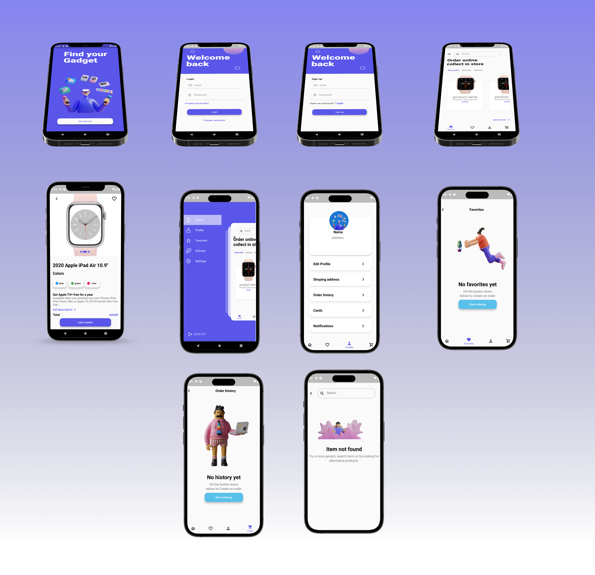

## Flutter Ecommerce UI App
This is a Flutter Ecommerce UI app that allows users to browse and purchase items from an online store. The app features a sleek and modern design, and utilizes various Flutter widgets and libraries to create a seamless user experience.

# Features
Browse products by category or search for items by keyword.
View product details, including price, description, and customer reviews.
Add items to cart and checkout using a secure payment gateway.
Manage account settings and order history.
Utilizes fakestoreapi.com to fetch product data.
# Installation
Clone the repository to your local machine.
Open the project in your preferred code editor.
Run flutter pub get to install the required packages.
Run flutter run to start the app on your emulator or device.
Dependencies
http: ^0.13.4
provider: ^6.0.0
flutter_staggered_grid_view: ^0.4.0
flutter_rating_bar: ^4.0.0
flutter_icons: ^1.1.0
flutter_svg: ^0.22.0
cupertino_icons: ^1.0.2
intl: ^0.17.0
# API
This app utilizes the Fake Store API to fetch product data. The API provides various endpoints for fetching product information, including images, prices, and descriptions.

# Provider
This app uses the Provider package to manage state. Provider is a simple way to manage app state without using complex state management patterns like BLoC or Redux. The app uses Provider to manage the user's cart and order history.

# Staggered Grid View
This app uses the flutter_staggered_grid_view package to display products in a grid format. The Staggered Grid View widget is a flexible and customizable way to display data in a grid.

Conclusion
This Flutter Ecommerce UI app demonstrates the use of various Flutter widgets and libraries to create a modern and sleek user interface. Feel free to modify and customize this app to fit your specific needs. Happy coding!
